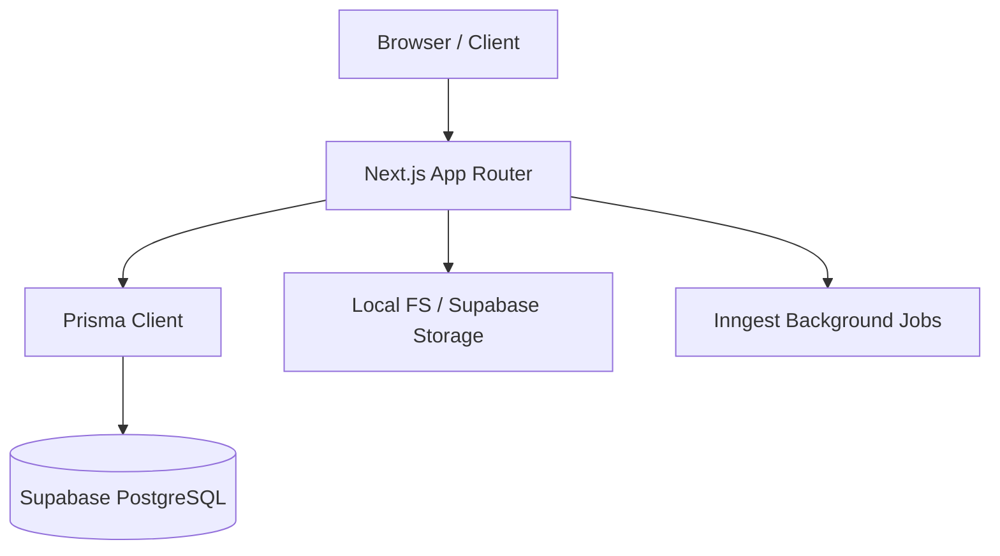

# Project Handoff Document - College Memory Archive

## 1. Current Project Status
- **Overall Completion**: ~85%
- **What's Complete**:
    - Core infrastructure (Next.js 15, Prisma, Tailwind).
    - Database schema for Batches, Events, People, Media, and Messages.
    - Admin CMS for managing all core entities.
    - Public routes for Seniors, Gallery, Timeline, and Messages.
    - Dynamic "Senior Spotlight" and "Random Memory" homepage features.
    - Robust empty-database state handling.
    - Local storage implementation for media.
- **What's Intentionally Deferred**:
    - Supabase Storage integration (currently using LocalStorage).
    - Achievements logic (currently a stub).
    - Video playback optimization.
    - Individual admin user accounts (currently a shared secret).

## 2. Architecture Overview
### Components:
- **Frontend**: Next.js 15 (App Router) with TypeScript, Tailwind CSS, and Framer Motion for animations.
- **Backend**: Next.js Server Components and API Routes.
- **Database**: PostgreSQL hosted on Supabase, managed via Prisma ORM.
- **Storage**: Currently Local File System (`public/uploads`), designed for migration to Supabase Storage.
- **Authentication**: Custom cookie-based session for Admin access, secured via shared secret (`ADMIN_SECRET`).
- **Deployment**: Optimized for Vercel, with Inngest for background processing.

### Simple Architecture Diagram:

## 3. Folder Structure
- `src/app`: Application routes, including public pages and the `/admin` workspace.
- `src/components`: Reusable UI components, layout elements, and section-specific modules.
- `src/lib`: Utility functions, data fetchers, database clients, and storage providers.
- `prisma`: Database schema and migration files.
- `public`: Static assets and the default local upload directory.
- `docs`: Project documentation, reports, and handoff materials.
- `scripts`: Maintenance and verification scripts.

## 4. Environment Variables
| Variable | Required | Purpose | Example Value |
| :--- | :--- | :--- | :--- |
| `DATABASE_URL` | Yes | Prisma connection string for PostgreSQL | `postgres://...` |
| `DIRECT_URL` | Yes | Direct connection string (Supabase) | `postgres://...` |
| `NEXT_PUBLIC_SUPABASE_URL` | Yes | Supabase Project URL | `https://xyz.supabase.co` |
| `NEXT_PUBLIC_SUPABASE_ANON_KEY` | Yes | Supabase Client Key | `eyJhbG... ` |
| `SUPABASE_SERVICE_ROLE_KEY` | Yes | Supabase Admin Key for uploads | `eyJhbG... ` |
| `ADMIN_SECRET` | Yes | Passcode for Admin access | `secure-passcode` |

## 5. Database Models
- **Batch**: Represents a graduating class (e.g., "Class of 2025"). Owns People and Events.
- **Event**: A specific occasion (e.g., "Freshers Party"). Contains Media and Messages.
- **Person**: A student/senior profile. Linked to a Batch and tagged in Media/Events.
- **Media**: Uploaded images/videos. Belongs to an Event and can tag multiple People.
- **Message**: Heartfelt notes or farewells. Can be linked to an Event or a specific Person.
- **UploadSession**: Tracks the status of bulk media uploads and background processing.

## 6. Admin CMS
- `/admin`: Dashboard with archive statistics and quick actions.
- `/admin/people`: CRUD for senior profiles, including photo uploads and featured status.
- `/admin/events`: CRUD for events/chapters, managing dates, locations, and batch assignment.
- `/admin/media`: Management of visual assets, supporting bulk uploads and tagging.
- `/admin/memories`: Management of the message wall and student quotes.
- `/admin/batches`: Management of high-level graduation years and archiving status.

## 7. Public Pages
- `/`: Homepage featuring the Hero, Random Memory, and Senior Spotlight. (Data from `getSeniors`, `getMemories`).
- `/people`: Directory of all seniors in the active batch. (`getSeniors`).
- `/people/[slug]`: Detailed profile of a specific senior. (`getSeniorBySlug`).
- `/gallery`: visual archive organized by curated collections and chronological feed. (`getAlbums`, `getMemories`).
- `/timeline`: Chronological milestone journey of the batch. (`getTimeline`).
- `/messages`: The message wall / digital yearbook quotes. (`getMessages`).

## 8. Remaining Work
### High Priority
- Migrate to Supabase Storage for production media hosting.
- Implement Achievement logic and directory.
- Fix remaining `: any` types in route handlers.

### Medium Priority
- Add Global Search across People, Events, and Memories.
- Implement moderation queue for public message submissions.
- Add email notifications for admin upload completion.

### Low Priority
- Multi-admin support with individual logins.
- Automated database backups to secondary regions.
- Scroll-triggered reveal animations for long pages.

## 9. Production Deployment Checklist
- [ ] Configure `DATABASE_URL` and `DIRECT_URL`.
- [ ] Set a strong `ADMIN_SECRET`.
- [ ] Initialize the database via `npx prisma db push`.
- [ ] Create initial `Batch` and `Event` in Admin.
- [ ] Configure Supabase Storage buckets and update `next.config.ts`.
- [ ] Setup Inngest environment keys.

## 10. Future Roadmap
- **Discovery Layer**: Enhanced "rediscovery" features using relationship weighted scoring.
- **Analytics**: Lightweight tracking of most-viewed memories and popular profiles.
- **AI-Tagging**: Integration with Vision APIs for automatic people tagging in photos.
