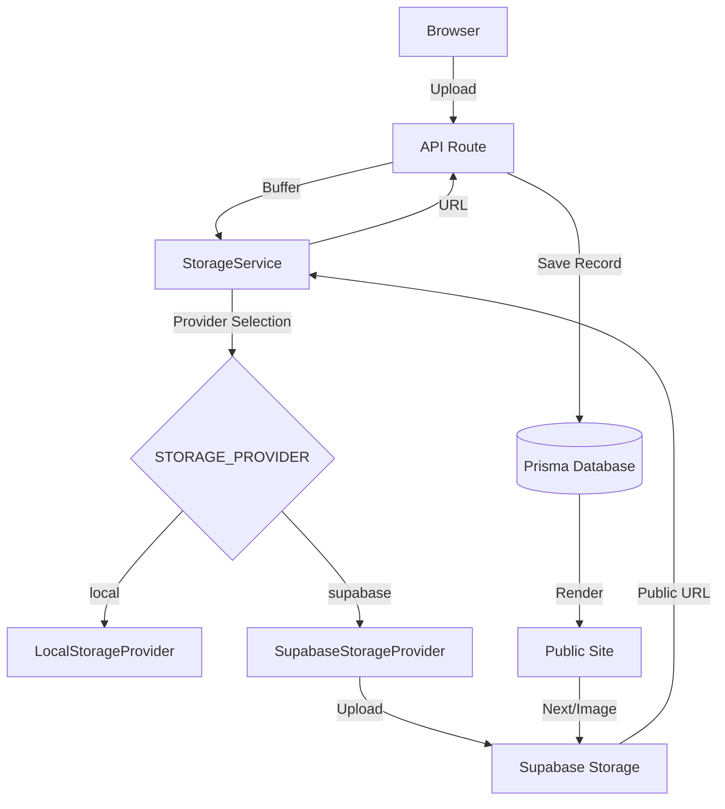

# Supabase Storage Migration Report

## 1. Current Storage Audit

### Flow
- **Browser**: Sends multipart/form-data to `/api/admin/media/upload/file`.
- **API**: Validates MIME type and size, then calls `storageService.uploadMedia`.
- **StorageService**: Uses `LocalStorageProvider` by default.
- **LocalStorageProvider**: Saves files to `public/uploads/<category>/<timestamp>-<name>`.
- **Media Table**: Stores the relative path (e.g., `/uploads/gallery/12345-image.jpg`) as the URL.
- **Delete Workflow**: Currently, `DELETE /api/admin/media/[id]` only removes the record from the database. **Local files are not deleted.**

### Components
- `LocalStorageProvider`: Handles filesystem operations in `public/`.
- `StorageService`: Abstraction layer for media operations.
- `Media` Prisma Model: Stores metadata and URL.
- `next/image`: Renders local images directly from the `public` folder.

---

## 2. Target Storage Architecture

### High-Level Flow

### Bucket Mapping & Folder Structure
Assets will be organized by business domain rather than file type.

| Domain/Bucket | Use Case | Folder Structure |
| :--- | :--- | :--- |
| **people** | Profile photos | `profile/<uuid>.<ext>` |
| **events** | Event covers/banners | `covers/<uuid>.<ext>` |
| **gallery** | Event gallery images | `<eventId>/<uuid>.<ext>` |
| **memories** | Memory attachments | `attachments/<uuid>.<ext>` |
| **documents** | Admin docs, PDFs, ZIPs | `admin/<uuid>.<ext>` |
| **general** | Miscellaneous assets | `misc/<uuid>.<ext>` |

### Filename Strategy
- **Format**: `<uuid>.<extension>`
- **Reason**: Guaranteed uniqueness and avoidance of collisions across different buckets/folders.

---

## 3. Implementation Plan

### SupabaseStorageProvider
- Implements `StorageProvider` interface.
- Uses `@supabase/supabase-js` storage API.
- Respects `NEXT_PUBLIC_SUPABASE_URL` and `SUPABASE_SERVICE_ROLE_KEY`.

### Provider Switching
- Controlled via `STORAGE_PROVIDER` env var (`local` or `supabase`).
- Defaults to `local` if unset.

### Deletion Strategy
- Update the DELETE API route to call `storageService.deleteMedia`.
- Both Local and Supabase providers will implement file removal to prevent "orphaned" storage objects.

---

## 4. Migration Plan (Future Phase)

Although not part of this sprint's execution, the following steps will be taken to migrate existing data:
1. **Scripting**: Create a script that iterates over all `Media` records where the URL starts with `/uploads/`.
2. **Transfer**: Download the file from `public/uploads/` and upload it to the corresponding Supabase bucket based on the `category` field.
3. **Update**: Update the `Media` record's `url` field with the new Supabase Public URL.
4. **Cleanup**: Once verified, delete the local `public/uploads/` directory.

---

## 5. Security & Permissions
- All buckets will be configured as **Public**.
- `SUPABASE_SERVICE_ROLE_KEY` will be used server-side for bypass RLS and performing administrative operations (upload/delete).
- **NEVER** expose the Service Role Key to the client.
